Animbits User Documentation
###########################

Tools for animators.

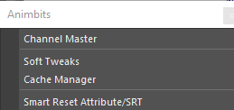

Channel Master
==============

Channel Master is an alternative ChannelBox, but allowing the user to create custom configurations and store it.

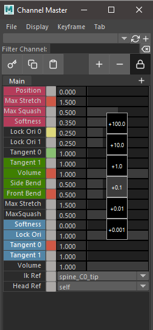

The configuration is stored in a persistent node in the scene. The data can be exported and imported.

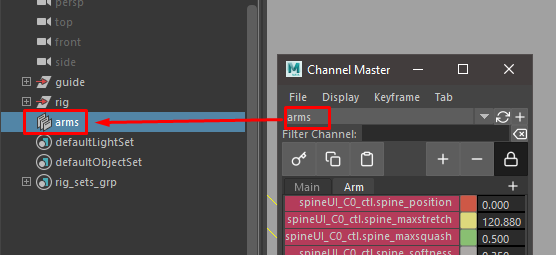

The channels can be a mix from different objects. The only rule is that the object that contains the channel and the channel master node should be in the same namespace.

However the  internal data is not stored with name spaces, so the same configuration can be re-used in different name spaces.

The Main tab works like  the regular ChannelBox and the data is rebuild on the flight. The advantage is that is possible to lock the content using the lock icon. Also create a node is not required to use the main tab

To create custom configuration, require a custom node.

.. warning::
	Custom configurations needs to be saved. If to be stored in the node. Missing to save the new configuration will  revert the channel configuration to the previous state when the node is refresh or change node in the drop-down menu

.. warning::
	The tool has been design to avoid bottleneck the evaluation while playback by turning off the refresh and updating on demand in some situations.
	When scrubbing the timeline still updating the channel values. This will take some FPS away (Only when Scrubbing, not in Playback).

	If you need to do scrubbing a lot and need the performance. You can change the Channel Master to empty Main tab, by lock the tab when nothing is selected. Or Just close Channel Master

	We planning to add more control over this in the future.

**File Menu:**

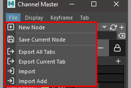

* **New Node:** Creates a new node

Also is possible  to add nodes from the node bar in the UI

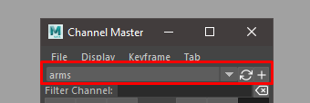

* **Save Current Node:** Save the current node configuration
* **Export All Tabs:** Export the current node configuration to a Json file
* **Export Current Tab:** Export current tab configuration to Json file
* **Import:** Import and create a new node
* **Import Add:** Import and add the configuration to an existing node

**Display Menu:**

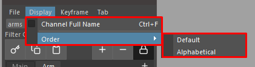

* **Channel Full Name:** Display the full name of the channel

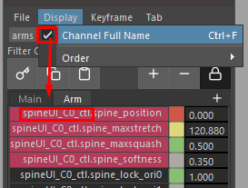

* **Order:** Arrange the channels by Alphabetic or Default order

**Keyframe Menu:**

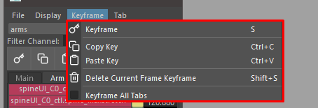

* **Keyframe:** Toggle a keyframe for all the channels in the current tab. If there is a channel that doesn't have keyframe will add keyframe. If all channels have keyframe it will remove the keyframe.
* **Copy key:** Copy current values in the buffer
* **Paste key:** Paste from buffer and set keyframe
* **Delete current keyframe:** Delete the current tab keyframe
* **Keyframe all tabs:** Keyframe command will be applied to all tabs. With this option active the toggle functionality will change to always key.

**Tabs Menu:**

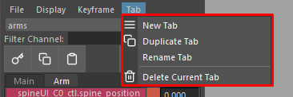

* **New Tab:** Create new tab.
* **Duplicate Tab:** Duplicate current Tab
* **Rename Tab:** Rename current tab
* **Delete Current Tab:** Delete current Tab

Tabs can be added using the + icon in the tabs row

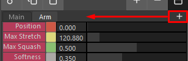

Channels
--------

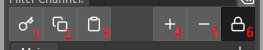

1) **Keyframe button:** Same command as keyframe menu
2) **Copy key button:** Same command as keyframe menu
3) **Copy paste button:** Same command as keyframe menu
4) **Plus Button:** Add selected channels from ChannelBox to Channel Master
5) **Minus Button:** Remove SelecteT channels
6) **Lock refresh:** in Main Tab

**Search channel:** will filter the channel list

.. image:: images/animbits/channel_master_filter.png
    :align: center
    :scale: 95%

**In the channels area we will find 2 context menus and a middle click slider precision widget.**

**Channel context menu:**  The actions in this menu can be apply to multiple selection

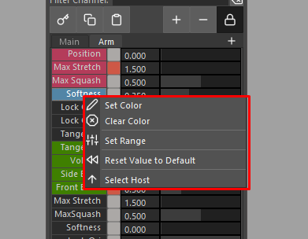

* **Set Color:** Set a custom color for easy identification.
* **Clear Color:** Clear custom color.
* **Set Range:** Set range min and max for the slider.
* **Reset Value to Default:** Reset the channel value.
* **Select Host:** Select the object that owns the channel.

**Keyframe channel button context menu.:**

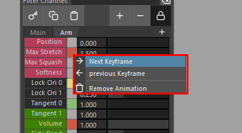

* **Next Keyframe:** Move time to the next keyframe.
* **Previous Keyframe:** Move time to the previous keyframe.
* **Remove Animation:** Delete channel animation.

**Keyframe button color coding:**

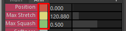

* **Red:** Keyframe in the current frame.
* **Green:** Animation but not keyframe in the current frame.
* **Yellow:** Current value changed.

**The slider precision** widget is similar to the one from Houdini

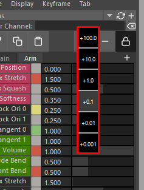

Soft Tweaks
===========

This tool create and manage SoftTweaks (ST for short) and also provide as simple API to import and export configurations, so is possible to integrate with your pipeline and animation publishing system.

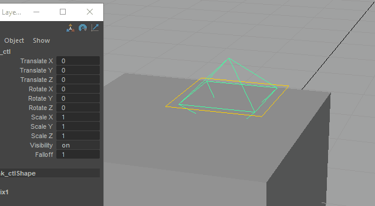

SoftTweak is a dynamic position tweak using softmod deformer
The credit of the idea goes to `Vasil Shotarov <http://bindpose.com/help-animators-fix-intersections-softmod-deformer/>`_ , thanks!

The SoftTweak have 2 controls. The Base represents the bind position where the ST will not have any effect. The main control will trigger the deformation when is not in the reset position..

.. image:: images/animbits/softtweak_ctl.png
    :align: center
    :scale: 95%

In the ST main control we can find a falloff channel to control the area of deformation

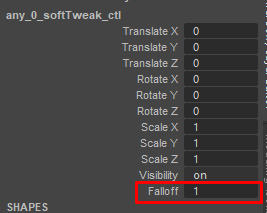

SoftTweak Manager GUI
---------------------

By default the SoftTweak is design to be used by shot and not part of a rig. However if is needed to publish a rig with some SoftTweaks there is an option to flag (is_asset_softTweak) the SoftTweak as asset tweak. So the tool will make a distinction between the ones that need to be publish with the shot and the ones that are included in the asset.

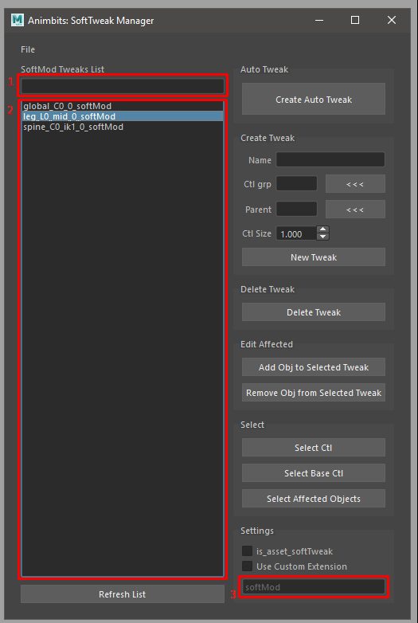

**File Menu:**

* **Export Selected:** Exports selected ST from the list
* **Export All:** Exports all the ST from the list. If search filter is used, will not affect the export. But export will make a distinction between regular SoftTweak and  asset SoftTweak
* **Import:** Import ST configuration from a file.

**GUI:**

* **Search Filter:** (1) Quick search filter of the SoftTweak list.
* **SoftTweaks List:** (2) ST selection list.
* **Create Auto Tweak:** Create a tweak based on the current selection.

	1. Select the objects to apply the ST
	2. Last element selected should be a control. This will be the parent of the ST. Also the ST will take the Name and the group(set) from the parent
	3. Click Crete Auto Tweak

* **Name:** Name of the new ST.
* **Ctl grp:** Group of controls to add the new ST controls.
* **Parent:** Parent of the new ST.
* **Ctl Size:** Parent of the new ST.
* **New Tweak:** Create a new ST.
* **Delete Tweak:** Delete the tweaks selected in the ST list.
* **Add Object to Selected Tweak:** Add selected objects to the tweaks selected in the ST list.
* **Remove Object from Selected Tweak:** Remove selected objects from the tweaks selected in the ST list.
* **Select Ctl:** Select the control from the tweaks selected in the ST list.
* **Select Base Ctl:** Select the Base control from the tweaks selected in the ST list.
* **Select Affected Objects:** Select the object affected by the the tweaks selected in the ST list.
* **is_asset_softTweak:** Tag the new created ST as an asset ST. This will also change the ST selection list to show the asset ST.
* **Use Custom Extension:** The new ST will have a custom suffix.
* **Suffix Name:** (3) Suffix name for the new ST.

API
-----

.. code-block:: python

	# To import a softTweak configuration from script editor or Shifter Custom Step:

	from mgear.animbits import softTweaks as st
	st.importConfigurationFromFile(filePath= path to the .smt configuration file)

	# to export configuration
	# list the softtweaks in the scene
	softtweaks = st._listSoftModTweaks(is_asset=False)
	# export
	st.exportConfiguration(softtweaks)

Smart reset Attribute/SRT
=========================

This command will reset the SRT (Scale, rotation and Translation of any selected object). If an attribute is higlighted in the Channel Box, will reset the channel instead.

**TIP:** Set a hotkey for this command using mGear Hotkey creator in utilities menu.

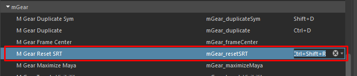

