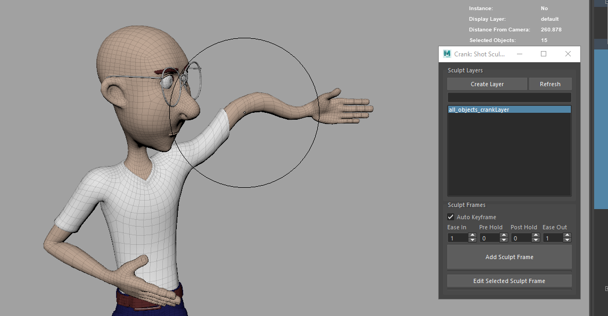
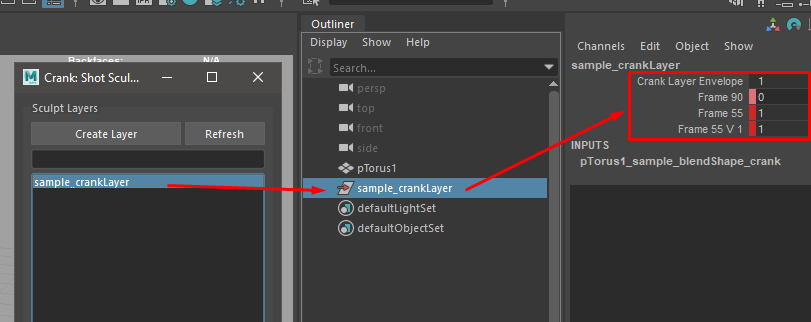
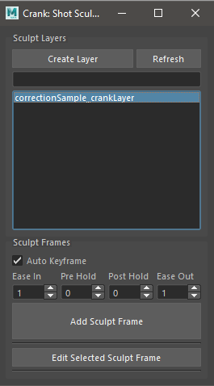
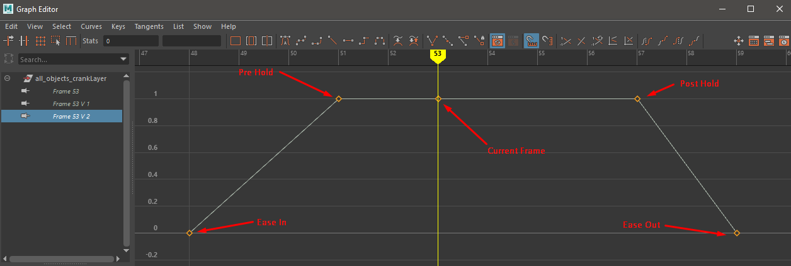
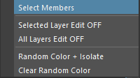
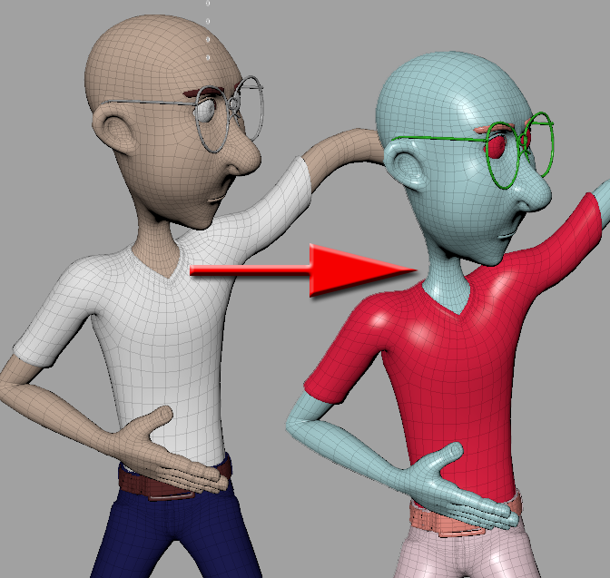
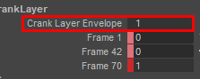

Crank User Documentation
###########################

Crank is a shot sculpting tool specially designed to handle several object and the same time. This tools can be used for general deformation correction, cloth simulation correction or animation exaggeration.

Crank uses only default Maya nodes and blendshape nodes. So not extra plugins are required to open as shot sculpted scene.

Sculpting can be apply to rigged meshes (local or referenced) or to cached animations (Alembic)

In order to deform an object. First we should create a "Crank Layer".
The layer can contain one or more objects. Also, an object can be included in more than one layer.

Crank Layers are represented in the scene with a regular Maya's transform node. This node contains a series of custom attributes and connections to handle and store the shot sculpting information and animation.

Several layers can be edit at the same time. But be careful if the same object is in several of this layers.

The blendshape nodes are created at the end of the chain and the deltas are set to use tangent space.

This should give the most stable result when the same sculpt is hold in several frames. However in areas where the geometry have collapse a lot (i.e: the internal part of the elbow when the arm is flexed), can result in a unstable interpolation if the sculpt is hold more than one frame.
Used in combination with Deltamush can mitigate some of the possible issues

**GUI:**

* **Create Layer:** Create a new layer from the selected objects.
* **Refresh:** Refresh layers list.
* **Search Filter:** Quick search filter of the Crank Layer list.
* **Layers List:** Crank Layers list.
	* LMB click will select the layer.
	* RMB click show the context menu.

* **Auto Keyframe:** If checked, crank will auto keyframe a range of frames, based on the. Starting from value 0
* **Ease In:** Ease In frames.
* **Pre Hold:** Pre hold frames before current frame. This are the frames where the value of the sculpt blendshape will be 1.
* **Post Hold:** Post hold frames after the current frame. This are the frames where the value of the sculpt blendshape will be 1.
* **Ease Out:** Ease In frames.

* **Add Sculpt Frame:** Add a new sculpt frame for the selected layers. If there is more than one sculpt for each frame it will and a version index. This can be useful to tackle different areas in the same layer.
* **Add Sculpt Frame:** Edit the selected sculpt frame. In order to edit the frame should be first highlighted in the layer channel box. Only one frame can be edited at the same time.

**Context Menu:**

* **Select Members:** Select the objects affected by the layer.
* **Selected Layer Edit OFF:** Turn off the editing status of the selected layers

	.. note::

		When we add a new sculpt or edit a sculpt frame. The blendshape target of each affected object is set to "Edit" status. To avoid any issue if we forget to set it OFF, a callback is initialized to turn off this edit status if we move the current frame in the timeline.

* **All Layers Edit OFF:** Turn off the editing status of all layers. This is can be also achieved by changing the current frame in the timeline.

* **Random Color + Isolate:** Create a render layer with random color for better visualization. This works based on shading groups, not individual objects.
* **Clear Random Color:** Delete the random color render layer.

**WARNING:** Currently is not possible to edit (add or remove objects) from a Crank Layer. Also any deleting option have been implemented. in order to deactivate the effect just set the Envelope value of the layer to 0.

