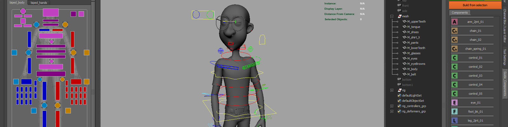

.. mGear: Maya rigging framework documentation master file, created by
   sphinx-quickstart on Thu Feb 04 19:02:39 2016.
   You can adapt this file completely to your liking, but it should at least
   contain the root `toctree` directive.

Welcome to mGear: Rigging Framework for Autodesk Maya
===========================================================

    mGear

`mGear website <http://www.mgear-framework.com/>`_
`Join mGear Community Forum <http://forum.mgear-framework.com/>`_

**Contents:**

.. toctree::
   :maxdepth: 2

   overview
   quickStart
   official-unofficial-workflow
   framework
   solvers
   animbitsUserDocumentation
   rigbitsUserDocumentation
   ueGearUserDocumentation
   crankUserDocumentation
   shifterUserDocumentation
   shifterComponentReference
   synopticUserDocumentation
   videoTutorials
   FAQ
   releaseLog
   license

Indices and tables
==================

* :ref:`genindex`
* :ref:`modindex`
* :ref:`search`

