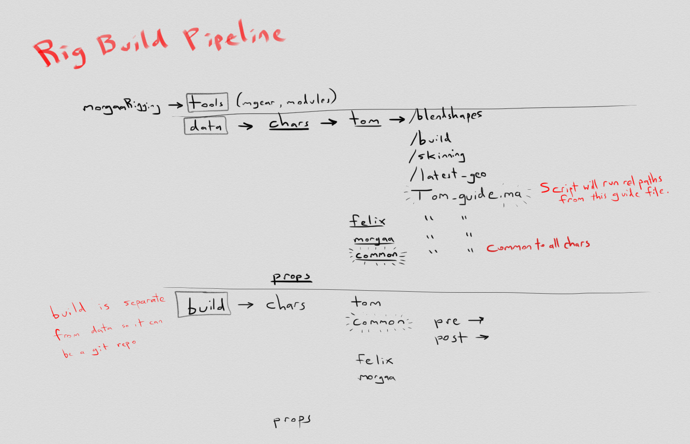

mGear Rigging Workflow
######################

.. note::
	This was the unofficial mGear Workflow document create by `Chris Lesage <https://rigmarolestudio.com/mgear-rigging-workflow/>`_ on his website. But now is official ;)

This official-unofficial document is a quick overview of how the mGear Shifter workflow works. It is meant to describe all the parts, so as you go through the tutorials and documentation, you have a full sense of everything.

This document is still a messy work in progress! I started writing it in mGear 2.6.1 just before mGear 3.0.3 was released. I'll update this page, as I continue to learn. I'll improve the illustrations too.

If you have any questions about my workflow, you can `find me on the mGear Forums <http://forum.mgear-framework.com/>`_ . The entire community there is great for answering questions.

Quick Reference
---------------

mGear official Youtube `video tutorials <https://www.youtube.com/channel/UCJsN2KCAD7qkA6-fOeB2fOw/videos>`_

`Python Documentation <http://www.mgear-framework.com/mgear/framework.html>`_

How to install mGear: tl;dw: use Maya.env and add this line to point to where you put the mGear folder. Don't copy/paste the scripts into your Maya prefs. Here are my example paths, as I develop my pipeline using Dropbox. The final configuration will be on our studio's network.

.. code-block::

	MAYA_MODULE_PATH = C:\Users\chrislesage\Dropbox\morgaaRigging\tools\mgear_2.6.1
	MGEAR_SHIFTER_COMPONENT_PATH = C:\Users\chrislesage\Dropbox\morgaaRigging\tools\mgearCustomModules
	MGEAR_SHIFTER_CUSTOMSTEP_PATH = C:\Users\chrislesage\Dropbox\morgaaRigging\data\build

**HELP!** See below for some answers to things that can go wrong.


FIRST THINGS TO KNOW About mGear
--------------------------------


1) **mGear** is an auto-rigging and animation framework. **Shifter** is the name of the rigging framework inside mGear. Shifter has individual rigging components you can build, and full rig templates you can start from.

2) It also has animation tools like IK/FK switching, space-switch baking, synoptic pickers, a basic shot sculpting tool, pose flipping and mirroring, etc. Some of these tools rely on the structure of the rig, so it is good to learn about them before you spend too much effort designing your own custom rig modules or editing the existing ones. If you change the rig, you'll have to also change the synoptic picker, for example.

3) There are a lot of Python modules and functions that you can use to script rigging tasks.

4) For example, ```mgear.rigbits``` there are functions for Vectors, creating transforms, building curve constraints, control icons, fcurves, skinning, logging and much more. A full list is in the documentation.

5) However, the docs just list the functions without much context or examples. All the tutorials on how to use mGear are found in the Youtube videos and they are in reverse chronological order.

6) As you learn how to use mGear, **you are going to need to design your own file structure** to organize all the data. **I recommend watching ALL of the Youtube videos first**, as you build your first test rigs, because Miguel offers most of the information you need, but it is contained within all the videos. This unfortunately takes a long time, but it will save you a lot of reorganizing later. For example, you'll want to organize a directory structure where you store all of your skinning, blendshape, and build scripts. And you will probably want to consider using version control like git. In this document, I will show you my example of how I organize my structure on a film which includes 33 characters.

7) Rigging is done by creating guide modules or using the existing template. When you first create a guide, it will give you some options, like the number of joints to use in a chain. When you click ```Continue``` it will build the guide. You then place and orient the guide. Additional settings are stored on the guide, like space switching, orientation, naming, etc.

8) When you build an mGear rig, you can define **PRE** and **POST** scripts which run before and after the main rig builds. If you open the settings of your main guide, you can access this interface. You can run your own files here. But if you click "New" in the interface, it will include some helpful boilerplate code, which will give you access to a special dictionary called stepDict from mgear.maya.shifter.customStep. This dictionary has information about the rig, so you don't just have to call the names of objects blindly from your scene.

9) The basic rigging workflow goes a bit like this:

	1) **QUICK OVERVIEW: Build Guide → Place Guide → Build Rig → Test rig → Save Control Icons, skinning, blendshapes, etc. → Delete rig → Tweak the guides → Write POST scripts -> Repeat**

	2) Open ```mGear → Shifter → Guides UI``` to access the UI for building modules.

	3) You use the Guide Templates, or build your own by assembling different modules.

	4) If you select a part of the guide and click "Settings" in the mGear UI, a window opens up with settings for that module. For example, you can set Chain_01 to be FK, IK, or FK/IK blend. You can also set the name, symmetry and more.

	5) All of your settings and guide placements are saved in the Guide. The root of the guide also has settings for the entire rig.

	6) There is no auto-symmetry (you could build it, in theory). Instead you delete the right side, and then **Duplicate Symmetry** on the left side in order to get symmetrical parts. (Or right to left.) In order for your guides to understand how to duplicate properly, you have to set your guides to be "Left", "Right" or "Center" in the guide settings. Center guides cannot be duplicated symmetrically.

	7) As you are building the rig, you can select certain components, or the entire guide and click "Build from Selection". This builds the rig you so you can test it. Do not be afraid to test early and test often.

	8) As you test your rig, you delete the rig, tweak the guides and your build scripts, and delete the rig and rebuild.

	9) When you build, you can add **PRE** and **POST** Python scripts, so you can customize the result to your own pipeline. Watch "Data-Centric Rigging" on mGear Youtube for more details. For example PRE: You could create a symmetry constraint, and then delete it in the PRE step.

	10) When creating **PRE** and **POST** steps, if you click "new" in the Custom Steps UI, then mGear will automatically populate your new script file with a bit of boilerplate. There are some functions for passing dictionaries of objects between steps. However, you can also just run plain vanilla Python in these files too.

	11) Try making some PRE and POST scripts early on as you are rigging so you can see how it works. But before you get too far, I recommend designing how you are going to organize the scripts for multiple characters or projects. For example, I have a folder called "common" where I store scripts that will be run on every single character. Then each character will have their own custom scripts stored in a separate folder, if needed. ALL of my scripts will live under one directory where I can track it using git.

	12) You can set up hotkeys to do some of the frequent mGear actions. mGear → Utilities → Create mGear hotkeys. This adds a bunch of actions in the Hotkey Editor. Then it is up to you to map them. I map "Build From Selection" to F7. And "Settings" to F6. Hitting F6 opens the module settings of the rig component I have selected.

	13) **Control Icons:** When the rig is built, you can tweak or replace your control icons, and click "Extr. Ctl". This stands for "Extract Control" and it saves the icons inside the guide. The next time you build the script, it will use your custom icons. To reset to the default, you can simply delete the icons from inside the |guide|controllers_org group. You can also import icons from another character or another file. They are based on name. If names don't match, they won't be used.

	14) Saving your Skinning

		When you build your rig, you can skin it, and then save the skinning to external .jSkin or .gSkin file. You can also save all your skinning in a bunch using a .jSkinPack file which basically just collects a list of all your separate .jSkin files. Even after saving a .jSkinPack file, you can still save the weights of an individual piece of geometry to its own .jSkin file. The Pack file will not change, unless you need to add or remove geometry.
		I recommend using the Ascii .jSkin files, instead of the binary .gSkin files. You can edit the Ascii files in a text editor, which lets you fix problems like mis-named joints. In the past, the binary files were a bit smaller on your hard drive, but since mGear 3.2, all skinning data files are about 90% smaller.
		**IMPORTANT:** This can be confusing to new users. When you export skinning, it will not automatically add it to your skinPack file. If you export a skinPack file, it will overwrite any existing skinPack file. So if you want to add a single skin to a skinPack file, the best way is to export a single skin file, add then add it manually to the skinPack file using a text editor.
		If you accidentally lose or overwrite your skinPack file, you might think you lost all your skinning. But the skin files are separate, and the skinPack file is just a text list of all those skin files. So you can often find and fix those kinds of problems.
		If you change the skinning on your character, and you already have a skinPack file, you just need to export the skin file. NOT the entire skinPack file again. I'll say it again: The skinPack file is just a text list of skinning data files, used for loading multiple skins all at once.

	15) Loading your Skinning

	During the rig build you can define a POST step to import your .jSkinPack files from a saved location.

	.. code-block:: python

		from mgear.core import skin
		skinPath = '/YOUR/PATH/HERE'
		skin.importSkinPack(skinpath)

	16) Saving your Blendshapes

	I just keep my blendshapes stored on my character's geometry. When I delete the rig, and rebuild, I run a Post Python script that connects my blendshapes to the controllers I want. This is completely dependent on your own personal rig design. So I don't have specific tips. But in general, `this is how I structure my blendshapes using a hook node <https://rigmarolestudio.com/blendshape_hooks/>`_

10) **Rigging the eyes and face and getting that data back when you rebuild**

There is an autorigging utility to build the eyes and lips based on selecting edge loops and points. Then the autorigger computes skinning for you. Here is how that works:

	1) Build your character from the guide. If you don't already have the biped template's face controls, I recommend making your own simple Control_01 modules for the upper lips, lower lips, and each eye. Configure them to have a joint. These controls will just be there so you can use that joint as a root for the face rig.

	2) When the rig is built, open the lips rigging utility from the mGear menu.

	3) From the lips rigging UI, you can just experiment with settings, until you get it right. If you get it wrong, delete your rig, rebuild, and try again. You can leave the lips rigging window open and not lose your configuration.

	4) When you are happy with the result, you can edit your skinning a bit if needed. **This part is tricky. I personally generate my eyes skinning, and then export it to an ngSkinTools file. Then I generate my lips, and export it as well. Later, after I've skinned the rest of my character, I import these layers on top of all the other skinning.**

	5) In the guide, turn OFF "Compute Topological Autoskin". Because if you have that checked, it will add the skinning before the lips exist, and mess up your weights.

	6) Save your lips config to a json file.

	7) Now that the json file is saved, you can add a POST step to your rig build, and use this code. Please be careful to note which version of the eyes and lips tool you are using. The legacy tools still exist. The new facial_rigger module is the one where the lips and eyes are in tabs of the same window. They use different functions, and save a different data format. I highly recommend using the new facial_rigger version.

	.. code-block:: python

		 from mgear import rigbits
		 import os
		 lipsConfigPath = os.path.abspath(os.path.join('YOUR PATH HERE'))
		 eyesConfigPath = os.path.abspath(os.path.join('YOUR PATH HERE'))

		 # OLD LEGACY eye_rigger and lips_rigger tool
		 rigbits.eye_rigger.eyesFromfile(eyesConfigPath)
		 rigbits.lips_rigger.lipsFromfile(lipsConfigPath)

		 # NEW "facial_rigger" module
		 rigbits.facial_rigger.eye_rigger.rig_from_file(eyesConfigPath)
		 rigbits.facial_rigger.lips_rigger.rig_from_file(lipsConfigPath)

	8) That is going to load your lip rigging. AFTER you load the lip rigging, you want to load your skin weights. Make sure to run the lips rig first, and then import the skinning, otherwise the joints won't exist yet! In this pipeline, you need to think about the order that things happen.


PIPELINE
========




A sketch for how I'll organize pipeline data. Inside each character will be blendshapes, skinning, the latest_geo, and any other stuff. By putting the data inside a character, it is easier to clone for a new character. There will also be a "common" character folder, where build scripts will live that will run on every character.
Shifter build scripts will be kept under a separate "build" directory, and tracked as a separate git repo.


* [ ] FIRST: Design the pipeline. The rigs will be built from guides. Figure out how to save this as a template asset that can easily be reused and iterated on.
* [ ] Maybe write this as a Google Doc or a Wiki doc.
The best way to install mGear is by putting it in a directory that can be accessed by your artists, and then pointed to by using the Maya environment variable MAYA_MODULE_PATH = /your/directory/here/foo

If you are creating custom modules, you should store them in a separate directory of your choosing, and then point to it in your Maya.env by using MGEAR_SHIFTER_COMPONENT_PATH = /your/directory/here/foo

Consider that in your studio, in the long-term, you will like be using mGear on multiple projects, supporting different versions of mGear, or customizing modules that are specific to a project.

Import the face template and place it (script this or improve the hooks?)

Do whatever custom clothes and hair needs rigging

HELP! How do I fix this???
--------------------------

In this section, I'll try to answer some questions that I got hung up on at first. When you are doing "Data-Centric rigging" like with mGear and Shifter, there is a level of complexity, and there are bound to be things that go wrong.

Q. I renamed all my controls and my custom icons are gone!
----------------------------------------------------------

A. No problem. Custom icons are stored by name. "[NAME]_controlBuffer". If you look under your guide, there is a group called controllers_org. Your icons are probably still under that group, but named with the old control names. You can simply rename the objects under the controllers_org group to match your new controls. The next time you build it will be fixed. You can also import or manually add shapes into that group.

Q. I made some gimmick joints and skinned them, but the next time I build, they are lost!
-----------------------------------------------------------------------------------------

A. Gimmick joints are not stored in the guide. You have to add them during the POST build stage. You can add them manually when you are first testing and skinning them. But once you are happy with them, add a POST step and use mgear.rigbits.addBlendedJoint(). There are 2 videos where Miguel shows how to create Gimmick Joints, but he doesn't explain how to rebuild them using Python until Data Centric Rigging 014: `Gimmick joints custom step and first rebuild <https://www.youtube.com/watch?v=-JFPD3k3Sl4>`_

Make sure to build your Gimmick Joints before importing your skinning, otherwise the joints won't exist yet!

Q. Is it possible to rig... X, Y or Z in mGear?
-----------------------------------------------

A. mGear Shifter is an open source rigging framework, and you can run any Python you like during your build process. So YES it is possible, but you will likely have to do some scripting or create your own custom modules. The existing Shifter modules do not cover every possibility you might want. As of January 2019, there are also very limited facial features, so you will have to design and rig a lot of your own face components. mGear is not a magic bullet for every rig you can imagine, but it is open enough that you can easily customize it to suit any needs.