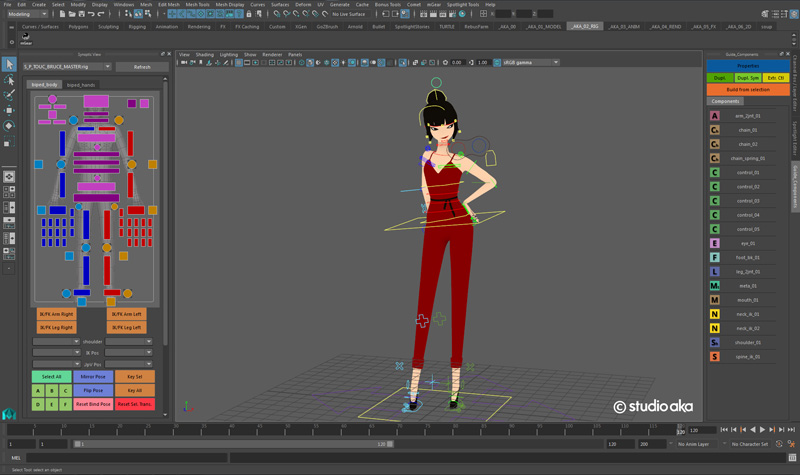

Overview
========

mGear is a rigging and animation framework for Autodesk Maya. mGear provides a set of convenient modules, tools and c++ solvers to streamline the development of rigging and animation tools.

Originally mGear was design and develope by `Jeremie Passerin <http://www.jeremiepasserin.com/blog/>`_ , since 2013 `Miquel Campos <http://www.miquel-campos.com/>`_ continued the project and evolved to the current design. From 2018 mGear is developed by the `mGear Dev team <https://github.com/mgear-dev/>`_

`Join mGear Community Forum <http://forum.mgear-framework.com/>`_

`Big Thanks! to all contributors <https://github.com/mgear-dev/mgear_dist/blob/master/AUTHORS.md>`_

.. note::

	from Miquel:
		Big thanks to `Jeremie Passerin <http://www.jeremiepasserin.com/blog/>`_ , he is the real master behind mGear design. I am just following  his steps and continuing what he started.

		Also special big thanks to `Ingo Clemens <http://www.braverabbit.de/>`_ for the OSX solver compilation and `Gaetan Guidet <https://github.com/gatgui>`_ for the Linux solver compilation and guidance in my C++ desert of knowledge.

		Thanks to `Chad Vernon <http://www.chadvernon.com/blog/>`_ , for his fantastic tutorials and open-source tools. Some of mGear's parts wouldn't be possible without it.

		And thanks!! to all the people who help me and support this project :)

    mGear have been used at Studio AKA for San Pellegrino ‘Dining By Starlight’. Rigged by Adam Avery

.. warning::

	I can't promise any kind of support and this tool is provided “AS IS”. Please read the LICENSE for more information.

	However, I am committed to continue developing mGear. So please, do not hesitate contact us if you found any bug or possible improvement.
