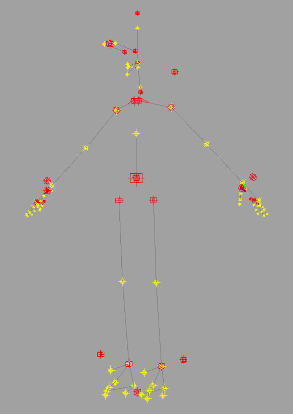
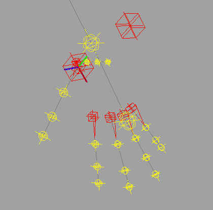
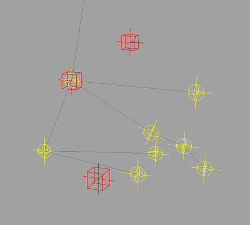
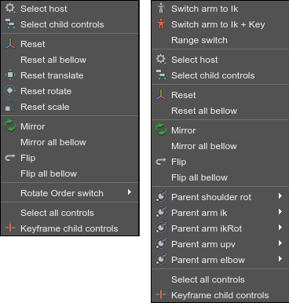
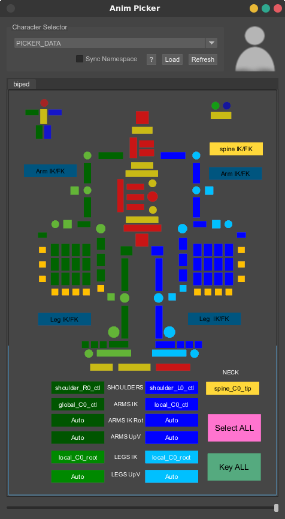

Quick Start
###########

This is a quick guide to get you up and running with mGear's Shifter. Shifter is the character rigging part of mGear, with which you can combine various components (arms, legs, spines, chains etc.) to rig most kinds of characters, creatures and mechanical contraptions. Shifter currently ships with over 40 different components, and more are constantly being added. Here we'll only focus on building a basic human biped.

Installation
============

To install mGear on your computer:

1) Download the latest mGear release from here_.
2) Unzip it
3) Copy the content of the mGear **release** folder to your maya/modules folder:
 a) Windows: \Users\<username>\Documents\Maya\modules
 b) Linux: ~/maya/modules
 c) Mac OS X: ~/maya/modules
4) Start Maya

You should now have an mGear menu in Maya.

Rigging a Biped
===============

Rigging a biped character is very quick and easy with mGear's Shifter, as it comes with ready made guide templates for both a standard biped and a quadruped. The steps involved in building a rig are:

#) Load the guide template
#) Position the guides to match your characters anatomy
#) Build the animation rig
#) Adjust the control curves if needed
#) Skin the character to the deformer joints
#) Animate!

Build Guides from a Template
----------------------------

Start by selecting mGear>Shifter>Guide Template Samples>Biped Template from the menu.

This builds all the guides we need to build a biped rig. The biped guides consist of multiple components that we will position to match the proportions of our character.  Each guide component consists of a:

- **root:** (red cubes) These are the top level node of each component.
- **position:** (yellow spheres) These are the positions of each joint (e.g. elbow, wrist etc).
- **blade:** (red triangular wedges) These controls the up axis of some components.
- **curve:** (gray lines) These are only for reference, to show how evrything connects together.

.. note::
   All components have a **root**, but not all have **position**, **blade** or **curve**.

You can position, rotate and scale the **root** and **position** guides to fit your character, and use the Blade Roll Offset attribute to adjust the **blade** guides.

Since we don't want to do double work, we can start by deleting the right side **root** guides; the **eye_R0_root**, **shouler_R0_root** and **leg_R0_root**. Once we're happy with the placement of the guides on the left side, we can simply use mGear>Shifter>Duplicate Sym to mirror them over to the right side.

.. note::
   You can test your rig at any point, by simply selecting the **guide** node from the Outliner and running mGear>Shifter>Build from Selection. The will bulid the complete animation rig. Once finished testing, you simply delete the **rig** node from the Outliner, and continue adjusting your guides.

Positioning the Guides
----------------------

Start by selecting the top **guide** node in the oulinter and scale it so the hip is in the correct place. Then work your way down the hierarchy, from the spine and out to the different bodyparts, positioning each one in turn. If you need to re-position a parent guide, after positioning it's children, you can temporarily de-parent the children, while moving the parent.

.. note::
   We'll only be covering what you need to get your character rigged here. For details on each component, see the :ref:`shifter-component-reference`. (TODO! Broken link)

**Settings**

Each **guide** has settings you can adjust to change the behaviour of that component. To access the settings of **guide**, simply got the mGear>Shifter>Settings menu. For this quick start, we won't be touching the settings, but it's good to know they are there.

**Host Guides**

You'll notice that next to the hand and feet, and above the head and one of the shouder there are **root** nodes that are seemingly not connected to anything. These are used to position Host controllers from which you can control things like IK/FK blending, arm/leg stretching and more.

**Hip and Spine**

There are two **root** nodes at the hip. The bigger one controls the position of the hips and where the controler that moves the entire upper body will be, while the smaller one sets the position of the controller that only moves the hips, keeping the torso in place. The yellow **position** guide controls the length of the flexible part of the spine.

**Neck**

The neck has two yellow **position** tangent guides, that control the neck curve. These are more usefull for rigs with longer necks with more neck joints.

**Thumb Rotation**

You'll notice that the thumbRoll **root** guide has an RGB axis. This controls the orientation of the thumbRoll controller. In addition the thumbs and each of the fingers have a **blade** guides to control the plane fingers should rotate on.

**Feet**

The foot has a lot of guides, but most of them are quite straight forward. The bottom three, the **heel** and **in/outpivot** set the pivot points when you rotate the foot. The one in front of the ankle called **eff** controls the direction of the FK foot control. The remaining ones are simply to position the characters joints and toes.

.. note::
   You'll notice there are no guides for the pole vectors for the knees and elbows. These are positioned automatically based on the direction the knee or elbow is pointing in when you build the rig.

Building the Animation Rig
--------------------------

Once you are ready to build the rig, you can simply select the **guide** node from the Outliner and run mGear>Shifter>Build from Selection from the menu. This will bulid the complete animation rig, with all controls ready to use. You can now hide the **guide** node in the Outliner, and test out the rig. If you need to adjust something, simply delete the **rig** group from the outliner, adjust your **guides** and rebuild it.

**Adjusting Controls**

Some times the shape or size of the default control curves doesn't fit well with the proportions of your character. You can easily fix this by selecting the vertcies of the control curves, and positining and scaling them as needed.

Once you're happy with your new control curves, select the ones you've modified and store them by choosing mGear>Shifter>Extract Controls from the menu. This will store them under **guide**|**controllers_org**, so that if you delete the rig and rebuild it, it will get your modified control curves instead of the default ones.

**Skinning**

When you built the rig a selection set was added under **rig_sets_grp** called **rig_deformers_grp** that contains all the joints in the rig you can skin to. Simply skin your mesh to these joints, and the rig is ready for animation.

.. note::
   You may be thinking, what do you do if you need to adjust the position of a joint after skinning and adding blend shapes? You can't simply delete the rig, and rebuild, as that will break the skinning. Shifter is built around the idea of `Data Centric Rigging`_. In short this means that rather storing all the skinning data, blend shapes, model and rig in one file, we store each in separate files, and bring it all together when we build the rig. This is a bit beyond the scope of this quick start, so hop on over to the mGear YouTube channel and check out the `Data Centric Rigging`_ workshop.

Animating the Biped
===================

The Shifter biped rig comes with a lot of functionality straight out of the box, including IK/FK blending, stretchy arms, legs and spines, space shifting and even rubber hosing, should you need it. It also performs quite well, so should be able to run in real-time on most modern hardware. Before starting animation, let's cover some of the interfaces to make your work easier.

mGear Viewport Menu
-------------------

At the top of the mGear menu, there is a checkbox for the mGear Viewport Menu. If you have this enabled it will replace Maya's default right click menu if you have Shifter animation controls selected. Note that the normal right click menu still work as normal, if you have something else selected.

This menu is dynamic, and changes based on what kind of controller you have selected. For most controllers and host controllers it will look like this:

**Controller Viewport Menu**

* **Select host**: Select the host controller for this bodypart, from which you can do IK/FK blending and more.
* **Select child controls**: Selects the child controls underneath the current one.
* **Reset**: Resets the selected control to it's default position (similar to bind pose)
* **Reset all below**: First does Select Child Controls, and then Reset like above.
* **Reset translate/rotate/scale**: Same as the normal Reset above, but for translate, rotate and scale specifically.
* **Mirror**: Mirrors the selected controllers pose over to the opposite side.
* **Mirror all below**: Same as Mirror, but for all the child controls
* **Flip**: Flip the selected controllers pose to the other side
* **Flip all below**: Same as fliip, but for all the child controls
* **Rotate Order switch**: Change the rotate order, while attempting to keep animation intact

**Host Viewport Menu**

* **Switch arm/leg to Ik/Fk**: Toggle between IK and FK, while keeping the pose intact
* **Switch arm/leg to Ik/Fk + Key**: Toggle between IK and FK, while keeping the pose intact. Adds keyframes before and after the switch.
* **Range switch**: WIP
* **Parent [various]**: Drop down menus for various controllers, such as the IK controller, that set what space that controller follows. You can, for instance switch between the arm's IK controller following the shoulder, body or global controller. If you have keyframes on the component already, this will add keyframes before and after the switch.
* **Select all controls**: Selects all the controllers of the rig
* **Keyframe child controls**: Keyframes all the child controls of the current selection

Anim Picker
-----------

mGear comes with a customizable Anim Picker interface to give you easy access to all controls. Choose mGear>Anim Picker>Anim Picker. When you first open it up, it will be empty. Hit the **Load** button and the **Selecte File** and navigate to the biped.pkr file (it comes with mGear and can be found in anim_picker/picker_templates/biped.pkr).

Once you've selected the biped.pkr file, hit the **Load Picker** button. A dialog will pop up askin you to enter a node name for the character. This will create a node in Maya that stores the Anim Picker layout in your scene. You should now see a dialog that looks like this:

From this interface you can select any of the controls by simply clicking the different colored boxes. You can also box select or shift-select multiple controls at a time. The little guy at the top left of the interface gives you access to the **host** controllers, while the two dots and a square on the right are eye controllers. In addition, there are a number of buttons you can use to switch between different spaces or toggle between IK and FK.

Finally if you right-click outside the boxes, you can choose Frame Selection, to zoom in on parts of the interface, or Reset View, to reset the zoom.

**Adding Multiple Characters to the Anim Picker**

If you have multiple rigs in your scene, you can switch between the characters using the Character Selector menu in the Anim Picker. Note that you can have multiple Anim Pickers windows open at the same time, if you have the screen space for it.

Animate
-------

That's it. You should now be ready to animate with mGear and Shifter. For more in-depth tutorials, please check out the `mGear Youtube channel <https://www.youtube.com/c/mgearriggingframework/>`_

.. _Data Centric Rigging: https://www.youtube.com/playlist?list=PL9LaIDCCDjfimQVcMdh0rG0MPabPG9FK-
.. _here: https://github.com/mgear-dev/mgear_dist/releases

