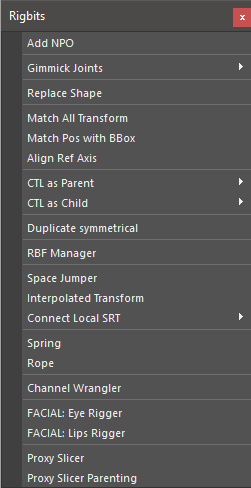
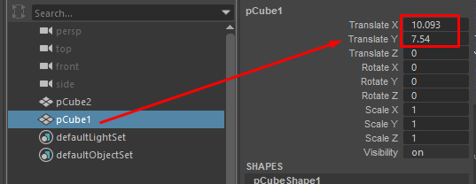
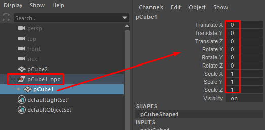
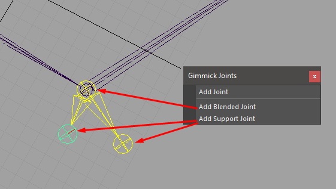
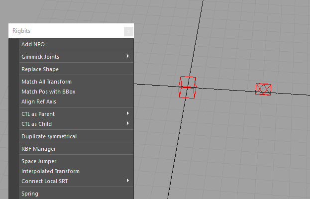
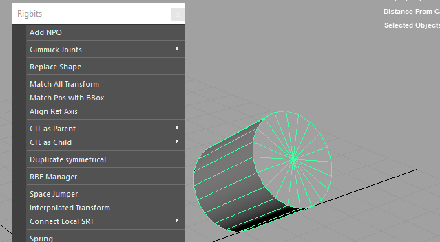

Rigbits User Documentation
###########################

Rigging tools

Add NPO
===========

Add a transform as parent of each selected object in order to neutralize the local values to the reset position

    The tranlate X and Y have some values

    All the local transform values are reset

Gimmick Joints
==============

Joint helper tools.

Add Joint
---------------------

Add a deformer joint to each selected object.

This command will try to add the joint to "rig_deformers_grp" or create it if doesn't exist.
Also will parent the joint under "jnt_org" if exist. If doesn't exist will parent the joint under the corresponding object.

Add Blended Joint
---------------------

Add a blended joint under a chain of joints. This joint will rotat 50% between 2 joints.

Add Support Joint
---------------------

Support joint are created under a blended joint and are design to help with deformation. Typically this kind of joints will also be driven by a SDK or similar.

Replace Shape
==============

Replace the shape of one object shape with another

Match All Transform
===================

Align one object to another object using the world Matrix reference.

Match Pos with BBox
===================

Center the position of an object in the center of the bounding box of an object.

Align Ref Axis
==============

Create a reference locator axis based on a point selection. This command needs at less 3 points.

.. Tip::

	Very useful to find rotation axis in mechanical rigs if the transformations of the mesh have been freeze.

CTL as Parent
==============

Create a control of the selected shape as parent of each selected object.

Ctl as Child
==============

Create a control of the selected shape as child of each selected object.

Duplicate Symmetrical
======================

Duplicate and mirror the selected object and his children. This is done by negating some axis scaling and inverting some of the values. This will provide a mirror behavior.
Also handle some renaming. i.e: from _L to _R

RBF Manager
===========

A tool to manage a number of RBF type nodes under a user defined setup(name)

Steps -
    set Driver
    set Control for driver(optional, recommended)
    select attributes to driver RBF nodes
    Select Node to be driven in scene(Animation control, transform)
    Name newly created setup
    select attributes to be driven by the setup
    add any additional driven nodes
    position driver(via the control)
    position the driven node(s)
    select add pose

Add notes -
Please ensure the driver node is NOT in the same position more than once. This
will cause the RBFNode to fail while calculating. This can be fixed by deleting
any two poses with the same input values.

Edit Notes -
Edit a pose by selecting "pose #" in the table. (which recalls recorded pose)
reposition any controls involved in the setup
select "Edit Pose"

Delete notes -
select desired "pose #"
select "Delete Pose"

Mirror notes -
setups/Controls will succefully mirror if they have had their inverseAttrs
configured previously.

Space Jumper
==============

Interpolate Transform
=====================

Connect Local SRT
=================

Spring
======

Rope
====

Channel Wrangler
================

Eye Rigger
==========

Lips Rigger
===========

Proxy Slicer
============

Proxy Slicer Parenting
======================
