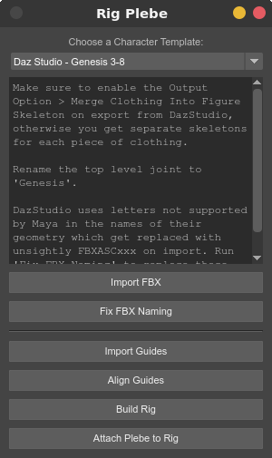
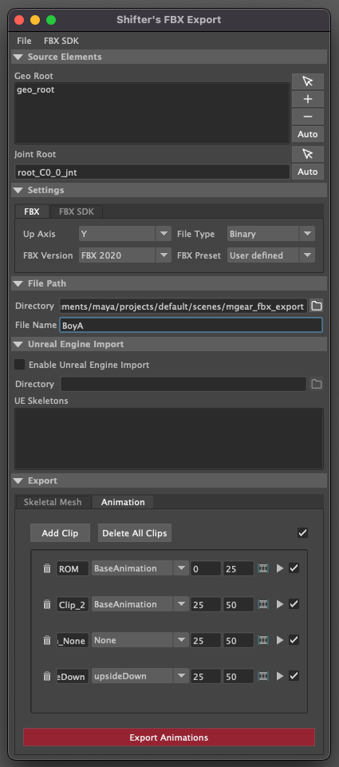
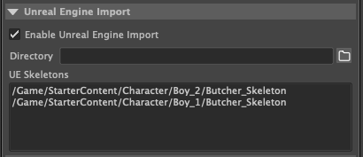
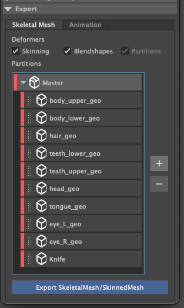
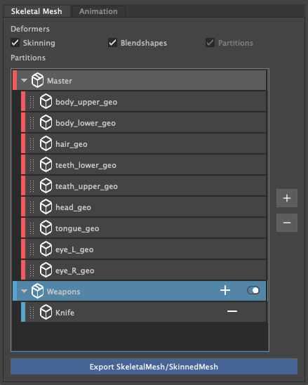
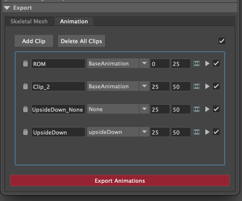
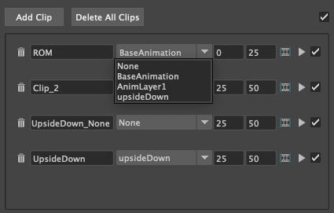
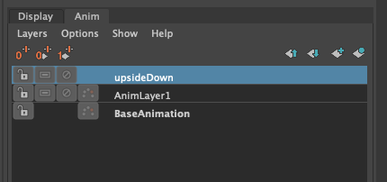

Shifter User Documentation
##########################

WIP section: Please visit:
`mGear Youtube channel <https://www.youtube.com/c/mgearriggingframework/>`_

* components
* creating new components
* guides templates and basic rig building
* stepped rig building
* scalability and reusability
* gotchas
* tips

Plebes - Instant Rigged Characters Using mGear
==============================================

Plebes is a simple template based tool to quickly rig characters from various character generators, such as DazStudio, Character Creator 3,  MakeHuman or Mixamo. What it does is build an mGear rig that matches the proportions of your character, and then constrains the joints of that character to the rig with just a few clicks.

How to Rig Plebes
-----------------

1) Open Plebes interface from the mGear>Shifter>Plebes... menu.
2) Export the character from the character generator as FBX and bring it into Maya.
3) Select the **Character Template** that matches your character generator.
4) Follow the template specific instructions in the Plebes interface.
5) Press **Import Guides** to import the mGear biped guides.
6) Press **Align Guides** to align the mGear guides to your character's joints.
7) Look over the guides, and manually adjust any that are off (e.g. typically the heel and sides of the feet).
8) Press **Build Rig** to build the rig.
9) Press **Attach Plebe to Rig** to constrain the character to the mGear rig. This  also removes any locks, keys/connections and/or limits on the translate, rotate and scale attributes on the character's original joints.

You can delete the rig, adjust the guides and rebuild it, like you can normally with mGear, by simply deleting the "rig" group and running the last two steps again.

.. note::
   Some character generators build their characters with completely straight or misaligned elbows and knees, which makes it impossible for mGear to figure out where to aim the knee or elbow, so you may need to rotate the joints slightly before aligning the guides to them, to make sure they are pointing in the right direction.

Known Limitations
-----------------

Plebes is meant to quickly rig generic characters, typically for use in the background or for crowd agents, so has some limitations. If you need more of a hero rig, you can use the guide placement as a starting point, but it's probably a good idea to skin the character directly to your mGear joints, rather than using **Attach Plebe to Rig**. Other known limitations include:

- Stretching and scaling of limbs may not work correctly for all templates, though it should work fine for all "normal" animation.
- Some characters come with additional joints, such as face joints, that Plebes does not add any controls to.

Plebe Templates
---------------

What gets aligned and constrained to what is defined by simple JSON templates. Plebes ships with templates for the several commonly used character genrators, but should you want to add more or modify the existing ones, you can easily do so. You can define the location of additional templates by defining the environment variable PLEBE_TEMPLATES_DIR. You can have multiple template dirs, so you can add your custom ones from your home folder or project specific ones as needed, just make sure each tamplate has a unique name.

The templates look like this:

.. code-block:: json

    {
        "help": "This show up when you hover over the template menu.",
        "root": "CC_Base_BoneRoot",
        "guides": [
            {"guide": "CC_Base_BoneRoot"},
            {"neck_C0_tan0": [
                "CC_Base_NeckTwist01",
                "CC_Base_NeckTwist02"
            ]}
        ],
        "settings": [
            {"arm_L0_root": [
                { "div0": 1 },
                { "div1": 1 },
                { "supportJoints": 0}
            ]}
        ],
        "joints": [
            {"local_C0_ctl": {
                "joint": "CC_Base_BoneRoot",
                "constrain": "111"}
            },
            {"spine_C0_0_jnt": {
                "joint": "CC_Base_Hip",
                "constrain": "110"}
            }
        ]
    }

- **help** - Documentation that shows up in the interface, detaling any specific things you need to do to work with this template.
- **root** - The top level joint/node from the character generator.
- **guides** - List of which guides to position at which joints.
    - If you match it to a list of joints, like with the neck above, it will be placed between them.
- **settings** - Settings to adjust on the guides before building the rig. Typically this is number of twist joints, but can be any attribute and value combination.
- **joints** - List of mGear joints and which of the character's joints to constrain to it.
    - **joint** - Name of the character's joint to constrain to mGear.
    - **constain** - Three 0 or 1's. First is if to point constraint, second is orient and third is scale.

.. _shifter-fbx-exporter:

Shifter's FBX Exporter
==============================================

The FBX exporter, allows you to export FBXs, as well having an integration into Unreal.

It supports the following Unreal processes:

- Exporting SKMs
- Exporting SKMs and using existing Skeletons
- Exporting Animation
- Exporting Animation layers

UI
-----------------

* **File** - Allows for users to serialise there settings, incase they want to reload them, or use them in a scripted pipeline.
* **FBX SDK(Optional)** - Allows the specify where the FBX SDK can be found. This allows the UI to perform some extra :ref:`features <shifter-fbx-sdk-features>`

Source Elements
++++++++++++++++++

These are the elements that make up the FBX, Geometry and Skeleton structure.

.. image:: images/shifter/fbx_exporter/fbx_shifter_roots.png
    :align: center

In the image above you can see that the **geo_root** is a group that contains all the geometry objects.

**Geo Root**: The list of geometry object roots. There can be more then one depending on how you have structured your character.

**Joint Root**: The root bone of the skeleton.

Settings
++++++++++++++++++

You can specify the FBX export settings here.

If *FBX SDK* enabled, then you can also perform additional commands post export.

- Remove Namespace
- Clean up scene.

File Path
++++++++++++++++++

- **Directory**: Location of the exported FBX files.
- **File Name**: Name of the fbx file that will be generated. This will also be used as the name of the **Unreal Assets**.

Unreal Engine Import
++++++++++++++++++++++

- **Enable Unreal Engine Import**: Enabling this, will allow for the other Unreal UI elements to become active. 
It also **refreshes** the **Unreal Skeleton** list, by querying the current open Unreal Project.

- **Directory**: The import location in Unreal for the SKM and Animations.

    .. image:: images/shifter/fbx_exporter/fbx_shifter_ue_select_folder.png
        :align: center
    1) Navigate to the folder in Unreal that you want to import to.
    2) Select the folder in Unreal's **Content Browser**
    
    .. image:: images/shifter/fbx_exporter/fbx_shifter_ue_path.png
        :align: center
    3) Click the folder icon in the Shifter UI. 
    4) The Package path to the directory will be retrieved from Unreal. You can modify it as you please, and the folder structure will be generated on import.

Export
-----------------

Skeletal Mesh
++++++++++++++++++

Allows for the exporting of Skeletons and Geometry.

- **Skinning**: Export Skinning data
- **Blendshapes**: Export Blendshapes that exist on the geometry.

**Partitions**

*(If available)* Performs partitioning of skeleton hierarchy data.

- When you add the **geometry roots**, all geometry child objects will get added to the **Master** partition.

Partitions are designed to allow you to export once, and generate new skeletons hierarchies that share the same root structure, but have all unneccesary leaf nodes removed.
*Unnessary leaf nodes*, would be any joint that is no longer driving geometry and no longer required to drive any other joints that have skinning. 

- Press the **"+"** button to create a custom partition. Once it has been created you can drag any other geometry objects from the master partition, to the custom partition.
- Right click on a Partition to change its colour, duplicate or delete it.

**Export Skeletal/SkinnedMesh**: Performs the FBX export, and if **"Enable Unreal Engine Import"** is active, the fbx's will be imported into the active Unreal Engine project.

.. note::
    If you want to use a pre-existing skeleton in Unreal, make sure to have selected the *skeleton* in the *Unreal Engine Imports* section. If you have not, a new Skeleton will be generated on import into Unreal. 

.. _shifter-fbx-sdk-features:

**FBX SDK Features**

If you have FBX SDK enabled, it will allow you to export the fbx SKM, and create a Skeleton per a partition group.
The skeleton that is created per a group, has trimmed all bones that no longer drive any geometry objects in the partition.

Animation
++++++++++++++++++

Exports the Maya animation as an FBX. **Clips** allow for sections of the maya timeline to be exported, while also utilising the animation layers.

**Clip**

Clips allow you to create named animation exportd, that represent a section of time on the maya timeline.

- **Trash can**: Removes the clip.
- **Name of the clip** will be appended to the file. eg. *BoyA_ROM*, *BoyA_Clip_2*
- **Drop-down**: represents the animation layer that will have its animation read, and exported as the final FBX.
- **Start Frame**: The frame number that the animation will start at.
- **End Frame**: The frame number that the animation will end at.
- **Set timeline range**: Updated Mayas timeline to fit the range that is specified.
- **Play**: Plays back the clip on loop.
- **Tick Box**: Disabled the animation clip, stopping the clip from being exported.

**Animation Layers**

- **None**: Uses the current configuration of active and disabled Animation Layers. Exporting exactly what you see in scene.
- Any other selected animation layer, will export the **Animation Layer** and **Mayas BaseAnimation**

