Custom Solvers/Deformers
==========================

mGear custom C++ Solvers/Deformers Documentation

mgear_add10Scalar
-----------------

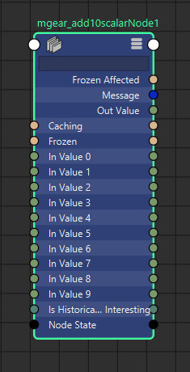

Add 10 scalar values. This node is deprecated. Only kept for backwards compatibility reasons.

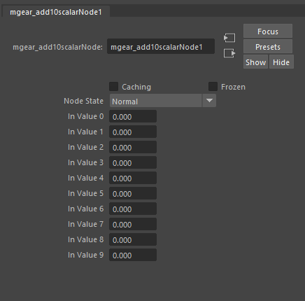

mgear_curveCns
-----------------

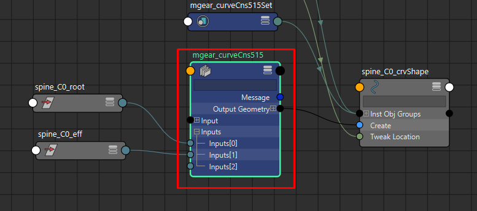

Generate a curve based on the input positions.
This is used in the Shifter guides to create the visual connections with the guide locations.

mgear_ikfk2Bone
-----------------

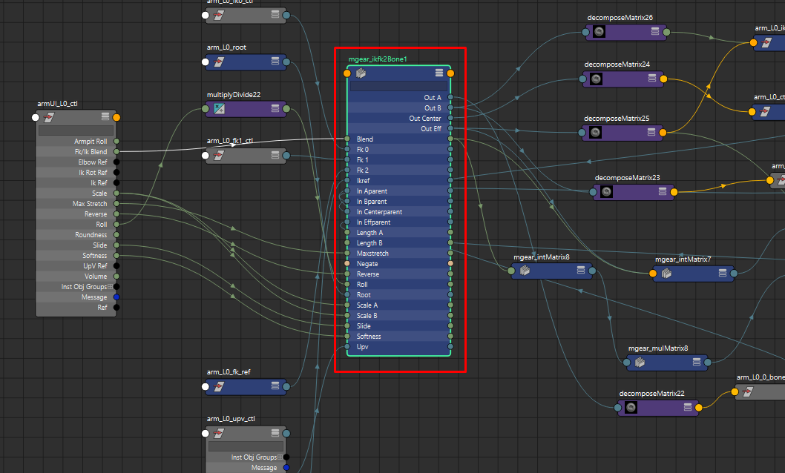

IK FK 2 bones chain solver.

Mainly used for legs and arms. The solver encapsulate many functions that will be very complex and expensive to evaluate using vanilla Maya nodes and other techniques like expressions.

Some of the features are, soft IK, reverse IK, squash, stretch, independent bone length, slide and roll.

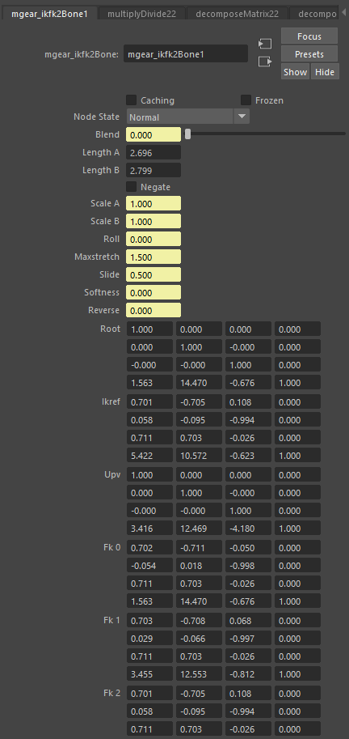
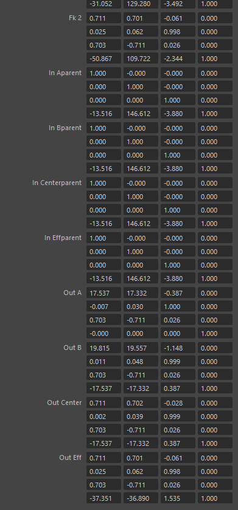

* **Blend:** IK fk blend
* **Length A:**  Rest length of the bone A (Arm)
* **Length B:**  Rest length of the bone B (Forearm)
* **Negate:**   Negate the solver direction (i.e: the right side arm negates the direction)
* **Scale A:**  Length multiplier for the arm.
* **Scale B:**  Length multiplier for the forearm.
* **Roll:**     Roll value. This value is complementarity to the Up Vector control.
* **Max stretch:**  Maximum stretching value for the IK behavior. Value 1 will represent the original size and not scale.
* **Slide:**  Slide the elbow position between the lengths of the arm and forearm. Value of .5 represents the middle point, whatever the proportions ratio is between the arm and forearm.
* **Reverse:**  Reverse the IK solver direction. (i.e: human leg vs Chicken leg)
* **root:**  Matrix. Root of the component world matrix
* **ikref:**  Matrix. IK control world matrix
* **upv:**  Matrix. Up vector control world matrix
* **FK0:**  Matrix. FK arm control world matrix
* **FK1:**  Matrix. FK forearm control world matrix
* **FK2:**  Matrix. FK hand control world matrix
* **in A parent:**  Matrix. Output bone A parent matrix (arm)
* **in B parent:**  Matrix. Output bone A parent matrix (forearm)
* **in Center parent:**  Matrix. Output elbow parent matrix
* **in Eff parent:**  Matrix. Output effector parent matrix (hand)
* **out A:**  Matrix. Output world matrix for bone A (arm)
* **out B:**  Matrix. Output world matrix for bone B (forearm)
* **out Center:**  Matrix. Output world matrix for elbow
* **out Eff:**  Matrix. Output world matrix for effector (hand)

mgear_intMatrix
-----------------

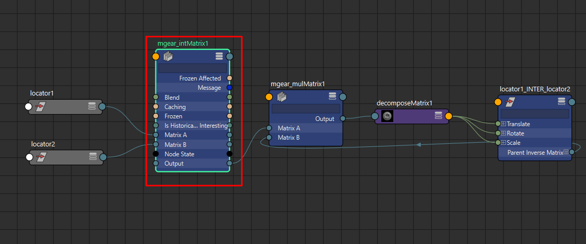

Interpolate between 2 input matrix using a blend value. The rotation is calculated in quaternion.

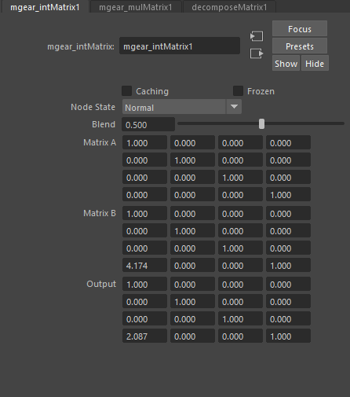

* **Blend:**    Blend between the 2 input matrix
* **Matrix A:** Input Matrix
* **Matrix B:** Input Matrix
* **Output:** Output Matrix

mgear_inverseRotOrder
----------------------

.. image:: images/solvers/mgear_inverseRotOrder_node.png
    :align: center
    :scale: 95%

Invert the rotation order. For example and input of "XYZ" will output ZYX.
This is very useful when you need to negate an animated rotation order to avoid gimbal.

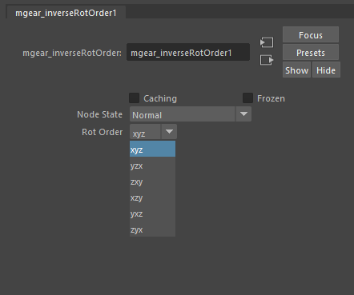

* **Rot Order:**    Rotation order to invert

mgear_linearInterpolate3Dvector
-------------------------------

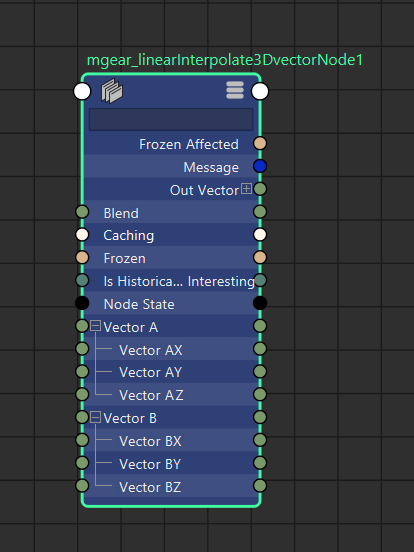

Interpolate between 2 input vector using a blend value. 
i.e: the XYZ position of 2 transforms.

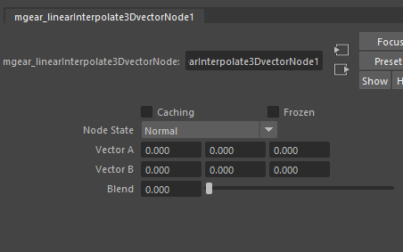

* **Blend:**    Blend between the 2 input matrix
* **Vector A:** Input Vector
* **Vector B:** Input Vector
* **Out Vector:** Output Vector

mgear_mulMatrix
-----------------

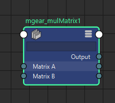

Multiply 2 input matrix. The only advantage between this node and the default one, is that with this you can visualize the values in the attribute editor.
With the default Maya's multMatrix node the values are not visible, this make very difficult debugging rigs in some situations.
For the rest are exactly the same and interchangeable. In terms of performance there is not noticeable difference.

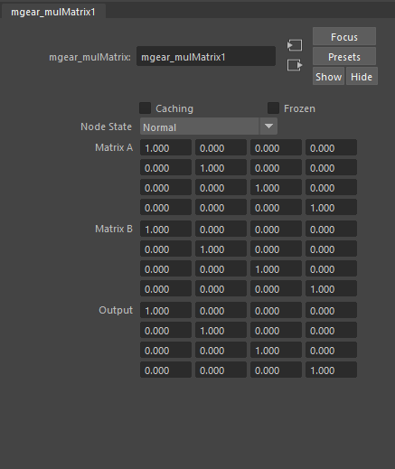

* **Matrix A:** Input Matrix
* **Matrix B:** Input Matrix
* **Output:** Output Matrix

mgear_percentageToU
-------------------

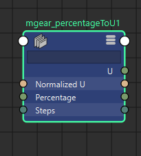

Converts a percentage values to a curve U value.

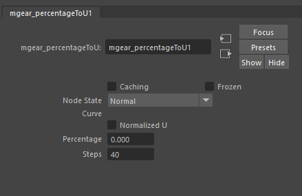

* **Curve:** Input curve.
* **Normalized U:** If active will normalize U value between 0 and 1.
* **Percentage:** Percentage value.
* **Steps:** Interpolation steps.

mgear_rayCastPosition
---------------------

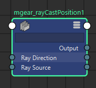

Raycast the contact position using a vector from 2 position inputs
The operation is set using Matrix, but usually we will use it only to get the position.

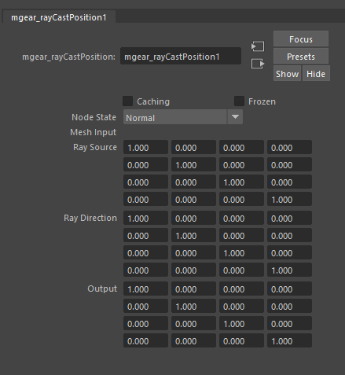

* **Mesh Input:** Contact Mesh.
* **Ray Source:** Matrix. starting position for the vector
* **Ray Direction:** Matrix. Aim position for the vector
* **Output:** Output Matrix with the position on the Contact Mesh

mgear_rollSplineKine
---------------------

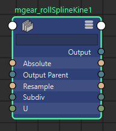

Roll Spline kinematic is a Bezier curve style with roll support.
This solver is used in several Shifter components. Mainly arms and legs.
This will be the equivalent of or similar to a ribbon setup, with the advantage of been much more lightweight at evaluation time.
Every input transform (world matrix plug) represents a point in the Bezier curve. And the scale in X axis of each transform represents the length of the Bezier tangents.
The main limitation is that the 2 tangents are always of the same length for each point.
In order to workaround this you can use 2 transforms in the same position. One representing each tangent, so the scale can be control independently.
Each mgear_rollSplineKine node, outputs only one point in the U value of the curve.

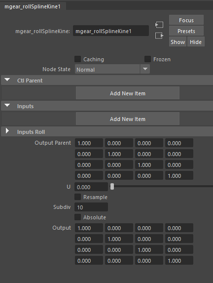

* **Ctl Input:** Array of Matrix. Input control points parent matrix.
* **inputs:** Array of Matrix. Transform controls world matrix
* **inputs Roll:** Array of Rotations. Transform controls rotation.
* **Output Parent:** Output transform parent Matrix.
* **U:** U percentage position represented from 0 to 1. NOTE: Usually the value should be always between 0.0001 and 0.999. The most extreme values are not taking in consideration the tangency for the output transform.
* **Resample:** Resample the output curve.
* **Subdiv:** Number of subdivision in the curve. Higher values will create a smoother curve but slower evaluation. Small values will create a more stepped curve, this can cause artifacts when sliding a transform on the U value. NOTE: Also, can have a little discordance between the same component in the left and right side. Due inversion of the direction. Usually the solution is simple as increase the subdivision.

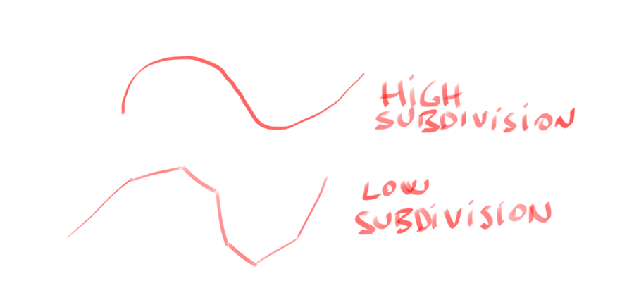

* **Absolute:** Change the way that the subdivision are distributed in the curve.
* **Output:** Output transform Matrix.

mgear_slideCurve
-----------------

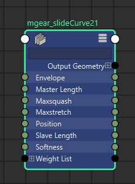

Deform a curve, sliding it on top of other. i.e: It is used in the Shifter spine component.
Use this function to apply the deformer: mgear.core.applyop.gear_curveslide2_op

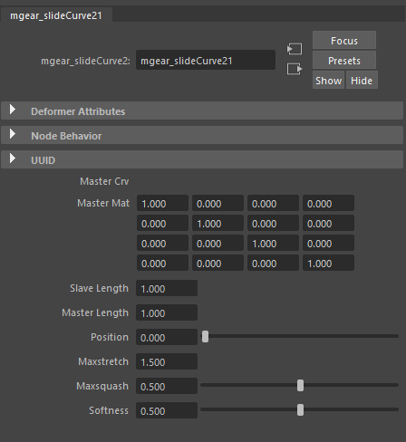

* **Master Crv:** Input Curve.
* **Master Mat:** Master curve matrix.
* **Slave Length:** Slave curve length.
* **Master Length:** Master curve length.
* **Position:** Slave curve position.
* **Max stretch:** Maximum stretch of the slave curve.
* **Max squash:** Maximum squash of the slave curve.
* **Softness:** Soft clamping for squash and stretch.

mgear_spinePointAt
-------------------

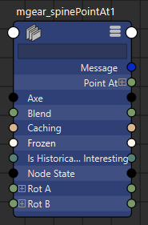

Point at an axis direction base in 2 input rotations. Note: This solver was design to handle the spine twist, but currently is not used in any component.

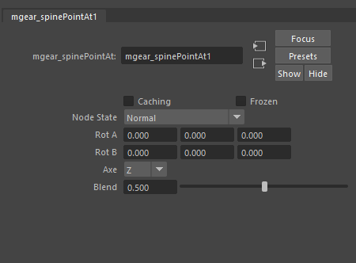

* **Rot A:** Input rotation A.
* **Rot B:** Input rotation B.
* **Axe:** Aim axis.
* **Blend:** Blend value between the 2 rotations

mgear_springNode
-------------------

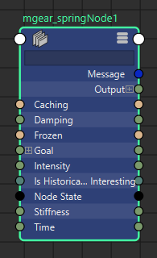

Spring dynamic solver based in goal position.

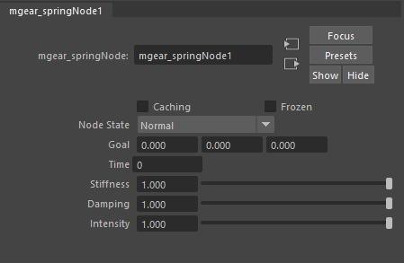

* **Goal:** Position goal.
* **Time:** Current time input.
* **Stiffness:** Stiffness value.
* **Damping:** Damping value.
* **Intensity:** Intensity value.

mgear_squashStretch_attr
-------------------

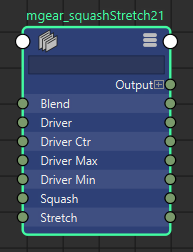

Squash and stretch solver.

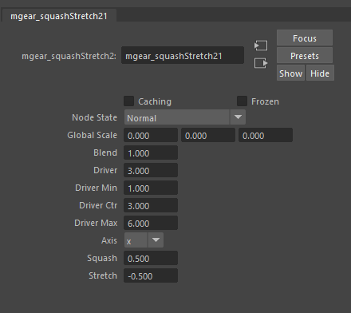

* **Global Scale:** Global scale reference.
* **Blend:** Blend to deal down the squash and stretch effect.
* **Driver:** Driver rest value.
* **Driver Min:** Driver minimum value where the squash and stretch effect will be calculated.
* **Driver ctr:** Driver control value.
* **Driver Max:** Driver maximum value where the squash and stretch effect will be calculated.
* **Axis:** Axis along the squash and stretch value will be calculated.
* **Squash:** Multiplication value for the squash direction.
* **Stretch:** Multiplication value for the stretch direction.

mgear_trigonometyAngle
----------------------

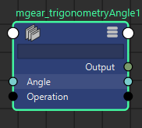

Sine and cosine trigonometry node

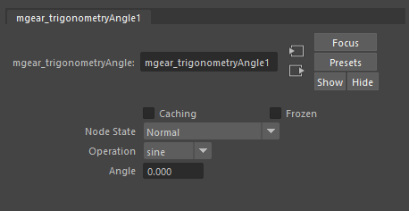

* **Operation:** Sine or Cosine.
* **Angle:** Input angle.

mgear_vertexPosition
----------------------

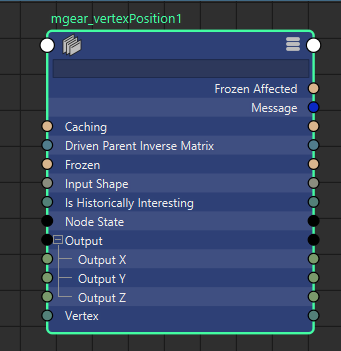

Get the world position of a given vertex

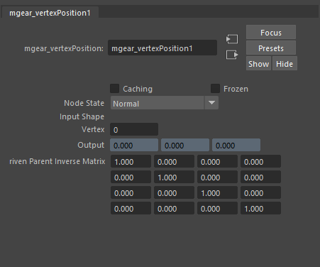

* **Input Shape:** Input mesh shape.
* **Vertex:** Vertex index number to track.
* **Output:** Output position.
* **Driven parent invert Matrix:** Driven parent invert matrix.

