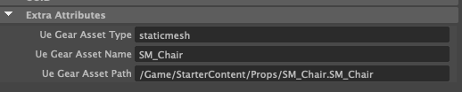
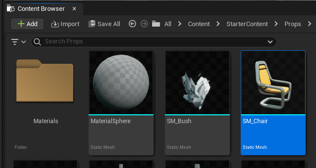
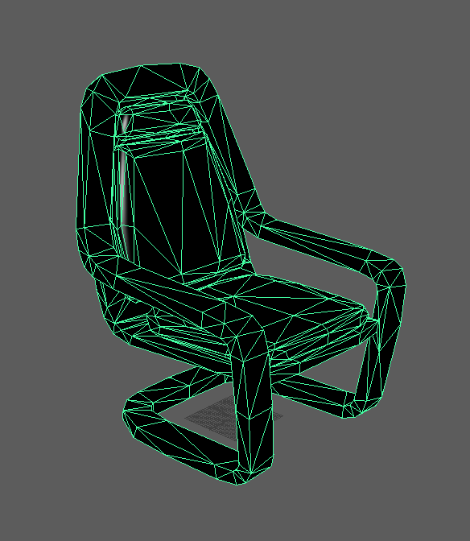
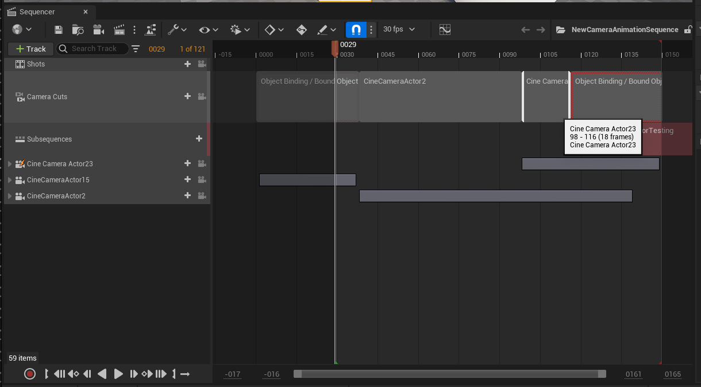
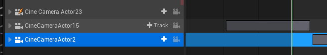
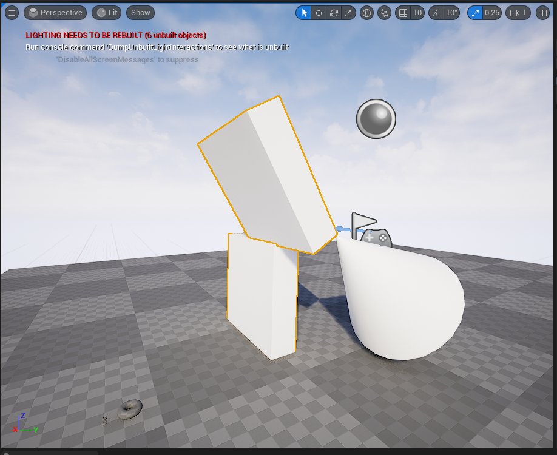
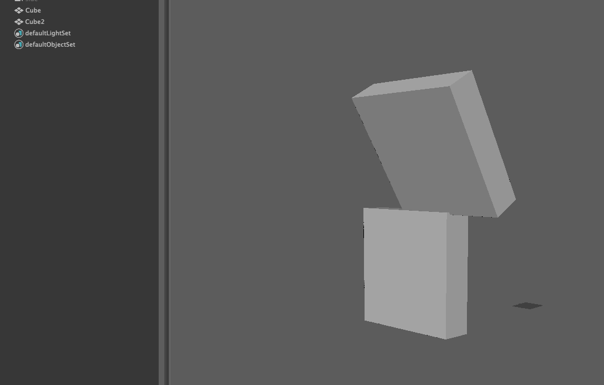
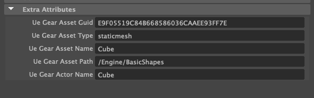

ueGear User Documentation
###########################

ueGear are a collection of tools that will allow for faster workflows between Maya and Unreal.

Unreal Setup
==============
In order to utilise ueGear, you will need to install the **Unreal ueGear plugin**, or download the **ueGear repo** and build the plugin.

* `Unreal Plugin`_
* `Github Repo`_

.. _Unreal Plugin: https://github.com/mgear-dev/ueGear
.. _Github Repo: https://github.com/mgear-dev/ueGear

Once the plugin is installed, launch the Unreal project you want to work in and open Maya. You can now use ueGear.

Menu
==============
The menu can be found under **mGear > ueGear**

.. figure:: images/uegear/maya_uegear_menu.png
    :align: center

As Unreal has multiple locations [**Content Browser**, **Active Level**] for assets, do be aware of where you are sending assets to and from.

.. _unreal-tag:

Unreal Tag
=============
ueGear tags, are extra attributes that are added onto the Maya DAG object as a bunch of extra attributes.
These attributes help keep data in sync, with objects that exist in Unreal.

As Unreal allows for multiple objects to be instantiated in a Level and have the same name, we need a way to keep track of which object is associated in Maya, as Maya does not allow for objects to have the same name.

* ue_gear_asset_type: refers to the type of asset this object will be in Unreal. 
* ue_gear_asset_name: Name of the asset in Unreal's ContentBrowser
* ue_gear_asset_path: Unreal package path, to where the asset will exist.

.. note::
    For most of the current ueGear tooling this will be **staticmesh**, if you want to export SkeletalMeshes(SKM) then please refer to the **Shifter FBX Exporter**, as that tool has special Unreal intergrations for exporting skeleton and animations into Unreal from Maya.

Assets
=============

**Static Meshes (SM)** can be synced between Maya and Unreal.

.. note::
    All assets require a :ref:`unreal-tag` for syncing.

Import
---------

To import an object.

1)  Open Unreal

2)  Select the object you wish to import in the Content Browser.

3)  In Maya click **ueGear > Import Selected Asset from Unreal**

4) The selected asset should now be imported into Maya.

**Note:** It will not bring in any texture or shading data. It will import the triangulated geo, and setup the tags.

Export
---------

To export an SM from Maya to Unreal

#) Make sure that the DAG has a tag. If one does not exist, create it and populate the :ref:`unreal-tag`
#) Select the asset.
#) In Maya click **ueGear > Export Selected Asset from Unreal**
#) Check Unreals ContentBrowser, the asset should now exist at the `ue_gear_asset_path` location.

Cameras
=============

LevelSequence Cameras can be exported into Maya, updated and exported back into Unreal.

Import
---------

To import a Camera into Maya

1) Open up the LevelSequence, which contains the camer you want to export.

2) Select the camera layer. **Note**: Make sure it goes blue and is highlighted, else it will not be detected.
3) In Maya click **ueGear > Import Selected Cameras From Sequencer**
4) The camera is now be imported into your Maya scene.

* Animation on the camera will be baked down per a Frame
* Importing the camera will try and match the FPS of your Unreal Sequencer. If Maya does not match it will warn you and ask if you want to update it Maya's fps.

Export
---------

To update the cameras animation track back to Unreal.

#) Select the Camera in Maya.
#) In Maya click **ueGear > Update Sequencer Cameras From Maya Selection**.
#) The Camera in Sequencer now has the latest keys.

Layout
=============

ueGear allows you to export assets that are in your Level, directly into Maya, reposition them and push the position changes back to unreal.

Import
---------

To import an SM from an Unreal Level

#) Select the asset or assets in Unreal.
#) In Maya click **ueGear > Import Selected Assets from Unreal Level**

The asset should now appear in Maya in the same location as it was in the Unreal Level.

.. raw:: html

    

.. note::
    Tags will automatically be generated for each asset, as Unreal has the ability to handle multiple assets with the same name, the tag will store the object guid.

Export
---------

To update the assets position back in the Unreal Level

#) Select the asset or assets in Unreal.
#) In Maya click **ueGear > Update Unreal Assets from Maya Selection**

The transformation data will now be updated in the Unreal Level.

Skeleton/Rigged Geo
======================

Please see the :ref:`shifter-fbx-exporter`

Animation
=============

Please see the :ref:`shifter-fbx-exporter`
